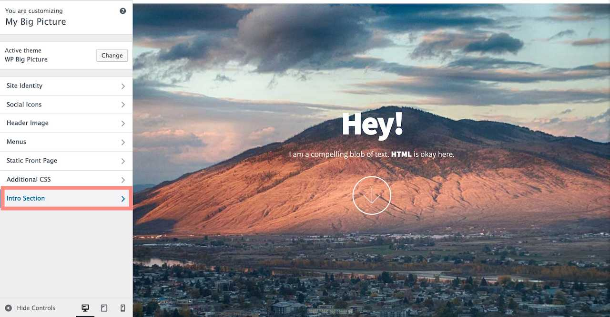
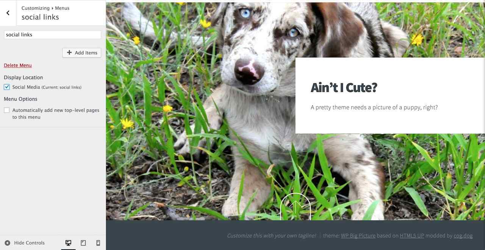
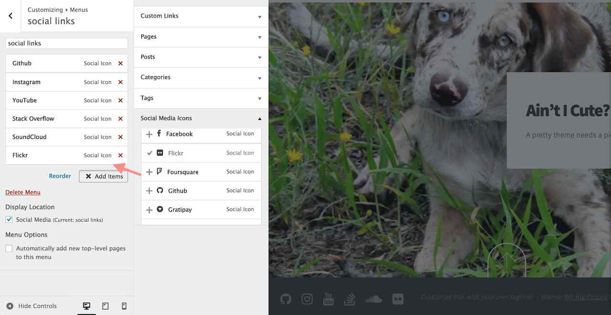
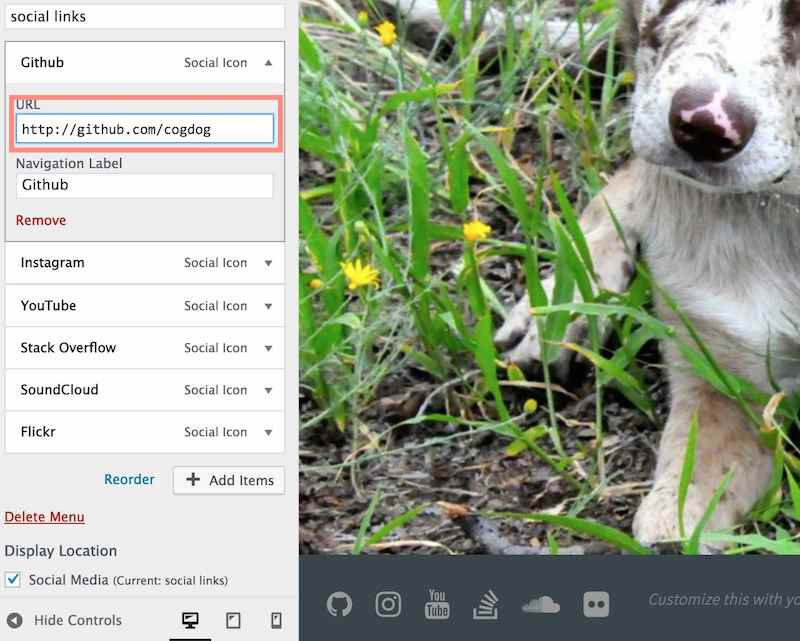
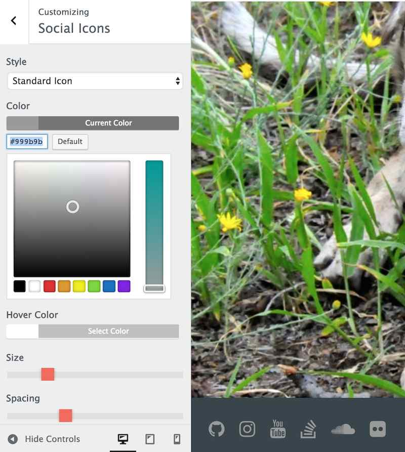

# HTML5up Big Picture Theme for Wordpress

A configurable Wordpress Theme version of [HTML5up Big Picture Theme](https://html5up.net/big-picturen) made for the internet by [@cogdog](http://cog.dog). It creates a simple, elegant calling card something that looks like

You can see a demo version at http://lab.cogdogblog.com/bigpicture/

The top/splash screen is configured in the Wordpress Customizer. The backdrop image is managed by the **Header Background** controls in the Customizer, which means you have an option of loading several images that can be set to appear at random on page load.

Subsequent sections as you scroll down (or use the automatic generated menu) are managed as separate posts. If the post has a featured image, it's layout will be with that image as a large background, with  title and content in the boxes. The theme automatically alternates between left/right side content

Posts without featured images will be displayed as full content, and can accommodate and kind of content, embedded media, etc that a Wordpress editor provides.

This also includes image galleries, and the extended types provided by the Jetpack plugin. There is a built in shortcode for generating a gallery in the animated style of the original theme (see below).

Each sections provide bottom arrow navigation to the next section. All content provides an `edit this` link for logged in users so they can directly edit the content.

The bottom footer can be customized with a social media icon menu and a custom footer menu text.

## Examples

* Demo version http://lab.cogdogblog.com/bigpicture/

## Installing

Install these theme on any self hosted Wordpress site. No luck on Wordpress.com, get a real web hosting package. 

You should download a ZIP file of this GitHub Repo (that's via the green **Clone or Download*" button above as a file `wp-bigpicture-master.zip`). 

The zip can be uploaded directly to your site via **Add Themes** in the Wordpress dashboard. Of you run into size upload limits or just prefer going old school like me, unzip the package and ftp the entire folder into your `wp-content/themes` directory.

## Updating the Theme

If you have ftp/sftp access to your site (or this can be done in a cpanel file manager), simply upload the new theme files to the `wp-content/themes` directory that includes the older version theme. 

For those that lack direct file upload access or maybe that idea sends shivers down the spine, upload and activate the [Easy Theme and Plugin Upgrades](https://wordpress.org/plugins/easy-theme-and-plugin-upgrades/) plugin -- this will allow you to upload a newer version of a theme as a ZIP archive, the same way you add a theme by uploading.

## Customizing with the Customizer

The main elements are set and previewed in `Appearance` -> `Customize`

### Site Name. Anything you want!
Under `Site Identity` edit for the title that shows up in top left

### Use Header Image to Set Top Background
Under `Header Image` upload an image (recommended size 1400 x 715 px or bigger) to place a background image

Once you have changed it, you will see it immediately previewed on the right

With the **Header image** controller you can upload more than one image, and use the option to randomize each time the site loads.

### Intro Section Content

The rest of the top / intro section is configured in the Customizer 

Change the title and the blurb content (which can include HTML) 

Enter in the **Menu Label** field a one or two word label for how this section will be listed in the top menu (if you leave it blank the men label will read `Intro`).

The text for **Footer Text** is actually used for the section at the bottom of the page, coming up next.

### Footer Section Content

The bottom left of the footer will by default display the name of the site and what ever is entered in the **Footer Text** goes in the section shown

However, the theme supports the use of a plugin for replacing the bottom left of the footer with customized menu of social media links.

To have a customized set of icon links in the footer, install and activate the [Customizer Social Icons](https://wordpress.org/plugins/customizer-social-icons/) plugin. This allows you to create a menu of links to social media sites.

Open the Customizer, and look under Menus to add a new menu. Call it whatever you like Under **Display Location** check the box for `Social Media`. 

Now when you look at the menus, open the entry for this new menu and click **+ Add Items** Open the menu under `Social Media Icons` - it will be added as a new menu item on the list. Add as many as you like.

Open up a new item and edit the link to your own address in a particular site:

Menu items can be re-ordered by drag and drop.

Return to the main screen for the Customizer, and open the panel for **Social Icons**. Here you can select icon styles, color, size, and spacing.

Use the color `#999b9b` to match the footer text.

## Editing Content

The content for the blocks are managed as Wordpress Posts.  For each block you want create a post. If you want the animated style with a large background image, add a Featured image that is at least 1400 x 715 px in size- big beautiful images. 

The content can use anything you like, but should be short, a few sentences. 

The order of the sections is controlled via the post sidebar **Post Attributes** option for... **Order**, lower numbers are displayed higher in the site.

The site now accommodates up to 10 sections.

Look for a setting called **Menu Label** under **Extra Big Picture Stuff** box below the post content. This defines what is used on the top navigation menu to link to this section. Use 1 or 2 word labels.

The Dashboard Posts view will list your sections in the order specified. To change the order quickly, hover a title and use the **Quick Edit** link to change the value of the order attribute.

## Big Picture gallery

You can use the built in Wordpress Gallery tools (under **Add Media** when editing a post) to add a gallery to a plain content section, but this theme has a special style of gallery that animates like the other content ([see the demo site](http://lab.cogdogblog.com/bigpicture/#content)).

First create  regular Wordpress Gallery tools (under **Add Media** when editing a post), click **Add Gallery**.  Upload or add the media you want to use (an even number works better). You can re-arrange te order by dragging images. 

The number of columns will not be used. But you can use the check box that will randomize the order on every page load.

This gallery will not look very impressive. Hang on.

Return to the editor, and make sure you have switched the editor to the Text view, where you will see the gallery shortcode:

Change the gallery shortcode that reads like:

`[gallery ids="176,666,721,720,719,186,194,40,43,38"]`

to read

`[bigpicturegallery ids="176,666,721,720,719,186,194,40,43,38"]`

This will use the images you picked but will display in the format provided by the Big Picture theme.

If you ever need to edit the Gallery (e.g. change the images), revert the name of the shortcode, use the visual editor in Wordpress, and click the edit icon.

## Suggested Plugins

* [Customizer Social Icons](https://wordpress.org/plugins/customizer-social-icons/) is needed to activate the social media icons on the front page
* [Fluid Video Embeds](https://wordpress.org/plugins/fluid-video-embeds/) will make sure your auto embedded videos (and other content wordpress can embed by URL) are responsive sized to fill the column width
* [Easy Theme and Plugin Upgrades](https://wordpress.org/plugins/easy-theme-and-plugin-upgrades/) allows you yo update the theme by uploading the zip file again as a new server (because wordpress does not provide this capability)
* [JetPack](https://wordpress.org/plugins/jetpack/) can add a number of capabilities, such as adding a contact form or a variety of other image galleries (try Mosaic). If you do [create a contact form](https://jetpack.com/support/contact-form/), make sure you also add and activate [Akismet](http://akismet.com/) because *you will get spam*
* [Regenerate Thumbnails](https://wordpress.org/plugins/regenerate-thumbnails/) If you change to this theme from another one, you should run this plug to re-generate previously uploaded images in the specific sizes used by the theme.

## Features / History

* v0.2 (Sep  3, 2017)  First release, for the brave, the few, the daring.

### Requests

* *You tell me* Fork and edit to suggest features or [toss them into the Issues bin](https://github.com/cogdog/wp-bigpicture/issues)

### Credits

* **Default backdrop image** "Where the Rivers Meet" flickr photo by cogdogblog https://flickr.com/photos/cogdog/15635307651 shared under a [Creative Commons (BY) license](https://creativecommons.org/licenses/by/2.0/)
* [HTML5 Up Big Picture theme](https://html5up.net/big-picture) is shared under a [Creative Commons (BY) license](https://html5up.net/license)
